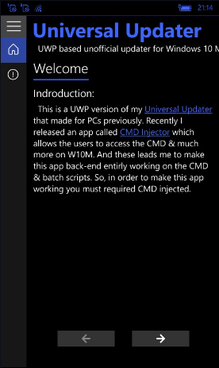
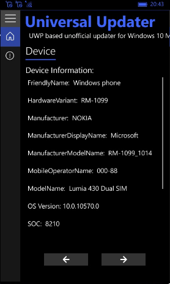
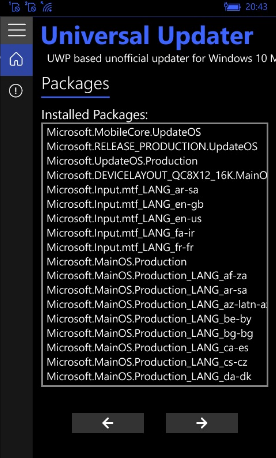
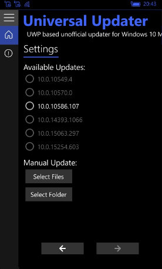
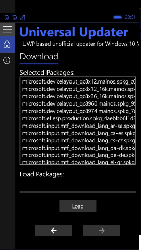

# Universal Updater W10M
Fork of Fadil's updater for Windows 10 Mobile for some special.. =)

# Screenshots
<table><tr>
<td>  </td>
<td>  </td>
<td>  </td>

</tr></table>

<table><tr>
<td>  </td>
<td>  </td>
<td>  </td>
</tr></table>

## Requirements
* W10M build 10240 or higher.
* CMD Injected using [CMD Injector v2.4.7.0](https://github.com/fadilfadz01/CMD.Injector) or higher.

## Available Updates
* 10.0.10549.4
* 10.0.10570.0
* 10.0.10586.107
* 10.0.14393.1066
* 10.0.15063.297
* 10.0.15254.603
* Offline package update

## Video tutorial

## " 3d party libs "
https://www.mediafire.com/file/9nc5rsihinwstlt/Microsoft_vcredist_.zip/file

## TODO
- Experimentation with 10.0.16212.1000 (iot, etc.)
- Experimentation with 10.0.16299.241 (Polaris)

## Thanks / credits
[Fadil Fadz](https://github.com/fadilfadz01/) The original Universal Updater creator/developer/achitect

## .
[m][e] 2022
